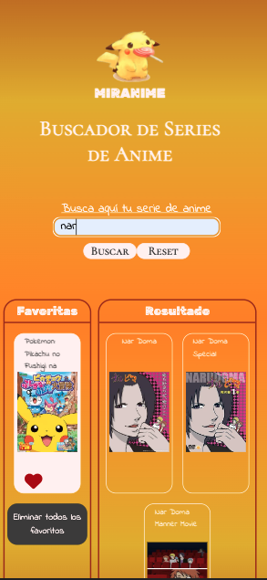
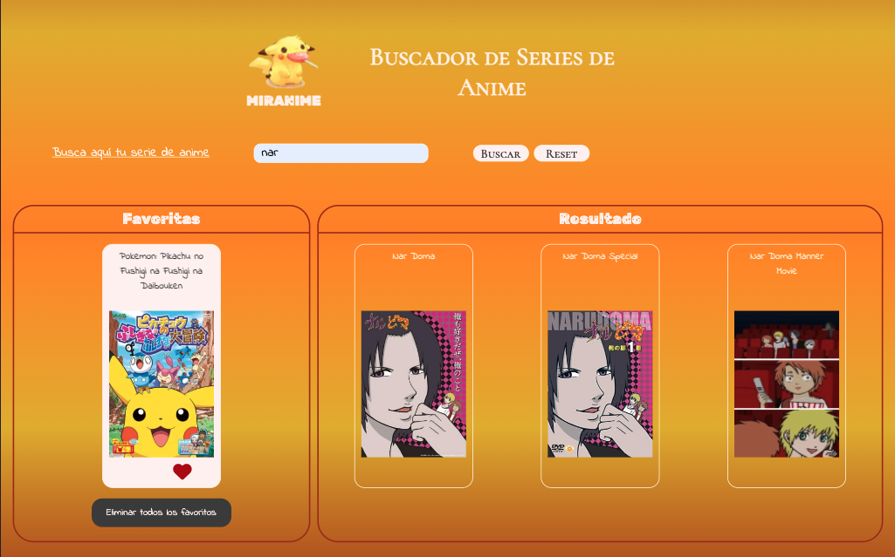
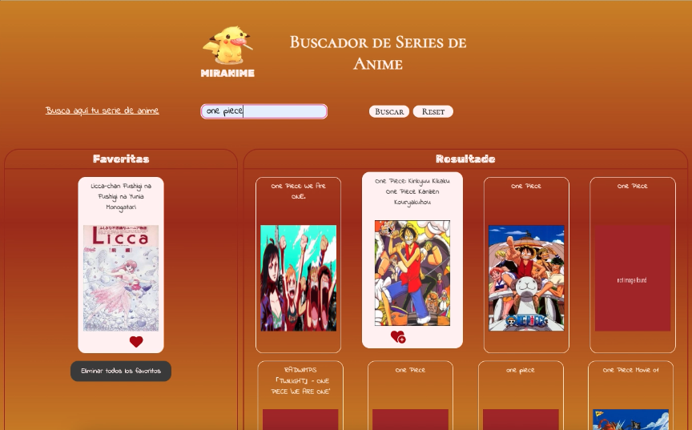

<h1 align="center">MIRANIME</h1>

---

<div align="center">
   Solution for exrcise of module 2's final evaluation by Olga Rodríguez Garrucho at <a href="https://adalab.es/">
     Adalab
    </a>.
</div>

<div align="center">
  <h3>
    <a href="https://www.youtube.com/watch?v=Ad86H9Vgx6g&ab_channel=OlguiitaRodriguez">
      Demo
    </a>
    <span> | </span>
    <a href="http://beta.adalab.es/modulo-2-evaluacion-final-olguita2412/">
      Solution
    </a>
  </h3>
</div>

---

## Table of Contents

- [General Info](#general-info)
- [Technologies](#technologies)
- [Installation](#installation)
- [Result](#result)
- [Contact](#contact)
- [License](#license)

---

## General Info

Solution for exercise of module 2´s final evaluation by Olga Rodríguez Garrucho.

Develop a web application to search for anime series, which allows us to de/marcate the series as favourites and save them in.

Use of HTML, SASS and JS.

The application has an input text for write the search and a button to search it. When the user write the search, in the right list (result list) appears the series of the request to API.

If the user wants to save like favourite a serie, only just have to click on it. This will change color text and background color and appears in the left list (favourites list). These favourites serie will be stored in the local storage. Also, these favourites series can be deleted from favourites list by clicking.

When loading the page, the local storage is inspected and if it isn't empty, the favourites list will contains the favourites serie and the rest favourites button. Else if it's empty, the favourites list will not contains anything.

The reset button cleans the search input and the result list.

The reset favourites button cleans the favourites list, it cleans the local storage and hidden it.

### Web responsive mobile:



### Web responsive desktop:



### Demo:

[](https://www.youtube.com/watch?v=Ad86H9Vgx6g&ab_channel=OlguiitaRodriguez)

---

## Technologies

- [Visual Studio Node](https://code.visualstudio.com/download) Version: May 2022
- [Git](https://git-scm.com/download/mac) Version: 2.36.1
- [Node JS](https://nodejs.org/es/download/) Version: v14.19.3
- [Adalab Web Started Kit](https://github.com/Adalab/adalab-web-starter-kit)
- [Git Hub](https://github.com/)

---

## Installation

For open the exercise it´s necesary to do the next steps:

```
$ git clone https://github.com/Adalab/modulo-2-evaluacion-final-olguita2412.git
$ cd ../path/to/the/file
$npm install
$npm start
```

---

## Result

To view the final´s result of exercise click [here](http://beta.adalab.es/modulo-2-evaluacion-final-olguita2412/).

---

## Contact

- Linkedin [Linkedin](https://{www.linkedin.com/in/olga-rodriguez-garrucho-231152212/})
- GitHub [@olguita2412](https://{github.com/olguita2412})
- Twitter [@olguiita24](https://{twitter.com/olguiita24})

---

## License

Copyright (c) 2022, Olga RG.
